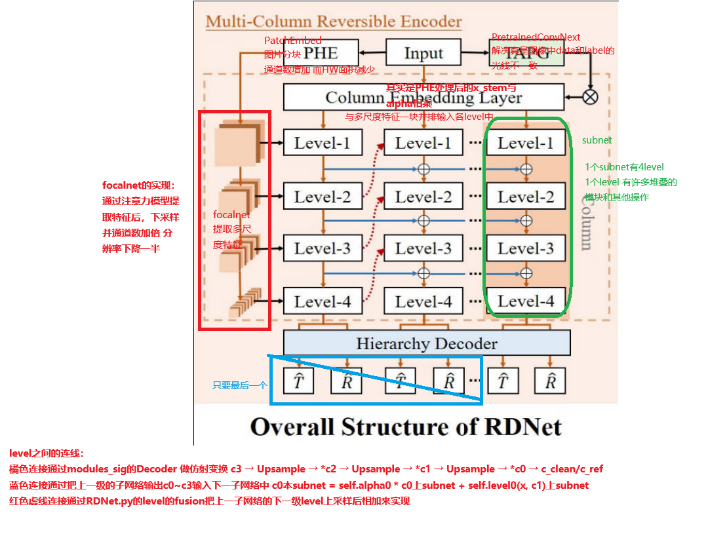

## 关键文件与关键关系
1. train.py 训练大循环
2. engine.py 定义了训练 验证 测试 三种逻辑
3. base_model.py 是cls_model_eval_reg.py的基类 做一些参数和gpu环境的配置
4. cls_model_eval_nocls_reg.py 是一个抽象model，管理三个net：net_i net_c netD
5. net_c 就是 models/arch/classifier.py 是一个pretrained的分类器 6分类 相当于是通道注意力之类的
6. net_i 就是 先用models/arch/focalnet.py生成多尺度图像特征后 再用 models/arch/RDnet_.py 处理 RDnet.py的末尾使用decoder.py 还原图像 
7. netD  没有被使用 它是networks.py 里面的 可以被选择的各类模型
8. 模型保存的只有net_i的参数 net_c的参数属于是请外援 事先加载了 是pretrained

---

## 网络架构
 
#### FocalNet 整体架构
```
# Input (B, 3, H, W)
# ├─ PatchEmbed ───▶ [B, C, H/4, W/4] → x_emb
# │   (4x4卷积嵌入，步长4)
# │
# └─ 分层处理 (共num_layers个阶段)
#    ├─ Stage 0 (dim=C, 分辨率H/4×W/4)
#    │   ├─ BasicLayer
#    │   │   ├─ ×depth[0] FocalModulationBlock （depth是多少 每个layer不一样 精炼特征）
#    │   │   │   ├─ PreNorm
#    │   │   │   ├─ FocalModulation (含 focal_level 级卷积)
#    │   │   │   │   ├─ 线性投影 → q/ctx/gates
#    │   │   │   │   ├─ 多尺度卷积堆 (核尺寸: focal_window + k*focal_factor)
#    │   │   │   │   └─ 门控加权融合
#    │   │   │   ├─ MLP扩展
#    │   │   │   └─ 残差连接×2
#    │   │   ├─ ×depth[1] FocalModulationBlock
#    │   │   │   ├─ PreNorm
#    │   │   │   ├─ FocalModulation (含 focal_level 级卷积)
#    │   │   │   │   ├─ 线性投影 → q/ctx/gates
#    │   │   │   │   ├─ 多尺度卷积堆 (核尺寸: focal_window + k*focal_factor)
#    │   │   │   │   └─ 门控加权融合
#    │   │   │   ├─ MLP扩展
#    │   │   │   └─ 残差连接×2
#    │   │   ├─ ×depth[2] FocalModulationBlock
#    │   │   │   ├─ PreNorm
#    │   │   │   ├─ FocalModulation (含 focal_level 级卷积)
#    │   │   │   │   ├─ 线性投影 → q/ctx/gates
#    │   │   │   │   ├─ 多尺度卷积堆 (核尺寸: focal_window + k*focal_factor)
#    │   │   │   │   └─ 门控加权融合
#    │   │   │   ├─ MLP扩展
#    │   │   │   └─ 残差连接×2
#    │   │   ├─ ×depth[3] FocalModulationBlock
#    │   │   │   ├─ PreNorm
#    │   │   │   ├─ FocalModulation (含 focal_level 级卷积)
#    │   │   │   │   ├─ 线性投影 → q/ctx/gates
#    │   │   │   │   ├─ 多尺度卷积堆 (核尺寸: focal_window + k*focal_factor)
#    │   │   │   │   └─ 门控加权融合
#    │   │   │   ├─ MLP扩展
#    │   │   │   └─ 残差连接×2
#    │   │   └─ 2x下采样 → [B, 2C, H/8, W/8]
#    │   └─ 输出归一化 (若在out_indices)
#    │
#    ├─ Stage 1 (dim=2C, 分辨率H/8×W/8)
#    │   ┌─ 结构同上，深度depth[1]，焦点窗口调整...
#    │
#    └─ Stage N (dim=2^N*C, 分辨率H/(4 * 2^N)×W/(4 * 2^N))
#        └─ 无下采样保持最终分辨率

# Outputs:
# ├─ outs: 多尺度特征列表 [(B, C_i, H_i, W_i)] 
# └─ x_emb: 初始嵌入特征

# 每Stage分辨率减半（H/4 → H/8 → ...）
# 每Stage通道数翻倍（C → 2C → 4C...）

# FocalModulationBlock的q ctx gates是什么？
# 输入 x 的形状​​：假设为 (B, C_total, H, W)，其中 C_total = C + C + (self.focal_level+1)。
# q：形状 (B, C, H, W)，表示查询（Query）特征。通过线性变换从输入中提取 ​​与位置强相关​​ 的特征
# ctx：形状 (B, C, H, W)，表示上下文（Context）特征。通过后续的 ​​多尺度卷积​​ 和 ​​门控融合​​ 提取上下文
# gates：形状 (B, self.focal_level+1, H, W)，表示多焦点级别的门控权重。动态调节不同尺度特征的贡献权重
# ​尽管 q、ctx、gates 来自x经过同一线性层映射出来的三个区域，但模型可以通过反向传播自动学习如何将输入特征分解为三个功能不同的部分。
```

---
#### RDNet网络架构，FocalNet是其中的baseball
```
# FullNet_NLP
# ├── Input: x_in (B,3,H,W)
# │
# ├── Stem Processing
# │   ├── stem_comp: 5x5 Conv (3->32) + LayerNorm
# │   └── baseball: FocalNet提取多尺度特征 → (c0,c1,c2,c3)
# │       │── baseball_adapter: 1x1 Conv调整通道数
# │       │   ├── c0: 192→64
# │       │   ├── c1: 192→128
# │       │   ├── c2: 384→256 
# │       │   └── c3: 768→512
# │       └── prompt机制（条件α融合）
# │           ├── prompt网络: Linear(6→512) → StarReLU → Linear(512→32)
# │           └── x_stem = prompt_alpha * x_stem (通道调制)
# │
# ├── SubNet 子网络处理 (循环num_subnet次)  子网络就是 把focalnet学到的各层次特征 在subnet仿射变换 在level的时候上下层交流融合
这么多子网络各有什么区别？subnet的实现都是一样的，level才是负责通道数的变化
那子网络之间如何沟通？循环里 上一子网络的输出 会成为本子网络的输入
# │   │── SubNet0 (first_col=True)
# │   │   ├── Level0
# │   │   │   ├── Fusion0: 纯下采样(x_stem →c0)
# │   │   │   └── layer[0]个 NAFBlock (带残差)
# │   │   └── 层级连接公式：
# │   │       c0 = α0*c0 + level0(x_stem, c1)

# │   │   ├── Level1
# │   │   │   ├── Fusion0: 下采样(c0→c1) 上采样(c2→c1)
# │   │   │   └── layer[1]个 NAFBlock (带残差)
# │   │   └── 层级连接公式：
# │   │       c1 = α1*c1 + level1(c0, c2)

# │   │   ├── Level2
# │   │   │   ├── Fusion0: 下采样(c1→c2) 上采样(c3→c2)
# │   │   │   └── layer[2]个 NAFBlock (带残差)
# │   │   └── 层级连接公式：
# │   │       c2 = α2*c2 + level2(c1, c3)

# │   │   ├── Level3
# │   │   │   ├── Fusion0: 纯下采样(c2→c3)
# │   │   │   └── layer[3]个 NAFBlock (带残差)
# │   │   └── 层级连接公式：
# │   │       c3 = α3*c3 + level3(c2, None)
# │   │
# │   ├── SubNet1 ……
# │   │
# │   ├── SubNet2 ……
# │   │
# │   └── SubNet3 ……
# │
# ├── Decoder 解码重构
# │   ├── Decoder (modules_sig.py) 输入 c3, c2, c1, c0
# │   │   ├── proj_layers + upsample_layers
# │   │   ├── depth 个 NAFBlock 通过​深度可分离卷积 + 门控 + 注意力​​的组合，实现高性能特征提取
# │   │   └── 特征融合路径：
# │   │       c3 → Upsample → *c2 → Upsample → *c1 → Upsample → *c0 → c_clean
# │   │  
# │   │
# │   └── 残差计算：
# │       x_img_out.append(cat(x_in,x_in) - decoder_output)
# │
# └── Outputs
#     ├── x_cls_out: []（未实现分类输出）
#     └── x_img_out: [残差图像1, 残差图像2...] (B,6,H,W)
# 关键数据流：

# 输入图像 → Stem预处理 → 多尺度特征提取 → 条件提示调制
#           ↓
# 子网络0 → 子网络1 → 子网络2 → 子网络3 （层级递进处理）
#           │          │          │          │
#           c0         c1         c2         c3 （多尺度特征更新）
#           ↓          ↓          ↓          ↓
# 解码器 ← 特征融合 ← 特征融合 ← 特征融合 ← 最终特征
#           │
#           └─→ 残差输出 = [双倍输入通道] - 解码重构结果 ：四元素

```

--- 
FullNet_NLP公式


Subnet公式

c0 = l0(x, c1) + c0*alpha0

c1 = l1(c0, c2) + c1*alpha1

c2 = l2(c1, c3) + c2*alpha2

c3 = l3(c2, None) + c3*alpha3


Level公式
x_clean = 下采样+上采样 第0行没有下采样 第3行没有下采样
经过几个NAFBlock再次提取特征


---

#### 关键公式与操作描述

**总架构**

 

如图所示，我们提出的多列可逆编码器（MCRE）受[2]启发，采用了一种不同于端到端模型[43,49]的架构，通过引入多个子网络，每个子网络接收由传输率感知提示生成器（TAPG）调制的列嵌入。该模型由列嵌入层和多个编码多尺度信息的列组成。在MCRE中，列之间的信息传播通过两种主要机制实现：同级列之间的可逆连接（图中用蓝色实线表示），有助于同级列之间的信息保留；以及相邻层级之间的连接（图中用红色虚线表示），并结合双向交互层级，实现跨层级的交互。这种设计有效地将多尺度特征解耦至第3层。作为例外，第4层没有相应的跨层级连接，符合终端层级的结构。MCRE中的初始列接收由PHE提取的分层信息，确保了语义丰富的表示。随后的多列可逆设计确保了在整个分解网络中分层信息的无损传播。


具体来说，我们的column嵌入层采用了一个步幅为2的7×7卷积层，为后续处理,产生2 × 2重叠的斑块$F_{−1}$。一旦获得嵌入，它将被馈送到每一column。对于第 $i (i∈{1,2，…N})$column,每个level的特征 $F_{j}^{i} ,j ∈ {0, 1, 2}$ ,接收到信息 $F_{j-1}^{i}$ 从当前column的较低level，以及 $F_{j+1}^{i-1}$ 从前一个column的更高level。将采集到的特征与当前level的信号 $F_{j}^{i-1}$ 进一步融合。上面描述的level $j$ 的操作表示为

$i$是column，$j$是level：
$$
F_j^i = \omega \left( \theta F_{j-1}^{i} + \delta (F_{j+1}^{i-1}) \right) + \gamma F_j^{i-1}
$$

式中，ω表示网络操作，θ和δ分别表示下采样和上采样操作。γ项是一个简单的可逆操作。在我们的实现中，我们利用可学习的可逆通道缩放作为可逆操作γ。这种连接是信息无损的，因为可以检索$F_{j}^{i-1}$,通过反向操作:

$i$是column，$j$是level：
$$
F_j^{i-1} = \gamma^{-1} \left( F_j^i - \omega \left( \theta (F_{j-1}^i) + \delta (F_{j+1}^{i-1}) \right) \right)
$$

值得注意的是，对于每column的第一level，我们定义$F_{-1}^{i}：= F_{−1}$。此外，由于最后一level不接收任何更高level的特征，$δ(F_{j+1}^{i-1})$ 会被丢弃。

---

**多层解码器**
我们的分层解码器集成了来自所有尺度的分层代码来生成最终输出。我们利用几个level解码器（LD）将具有较小分辨率的高维层次结构解释为具有较大分辨率的低维层次结构。上采样操作，在level解码器(LD)，由像素shuffle[33]实现，这是缩放前后的信息一致算子。然后将上采样特征与前尺度的信息进行乘法调制融合。最终，最终的LD产生层残差($T_{res}$和$R_{res}$)再进行一次像素洗牌上采样操作，并与原始输入连接，得到层分解$T$和$R$

**传输速率感知型提示生成器**


